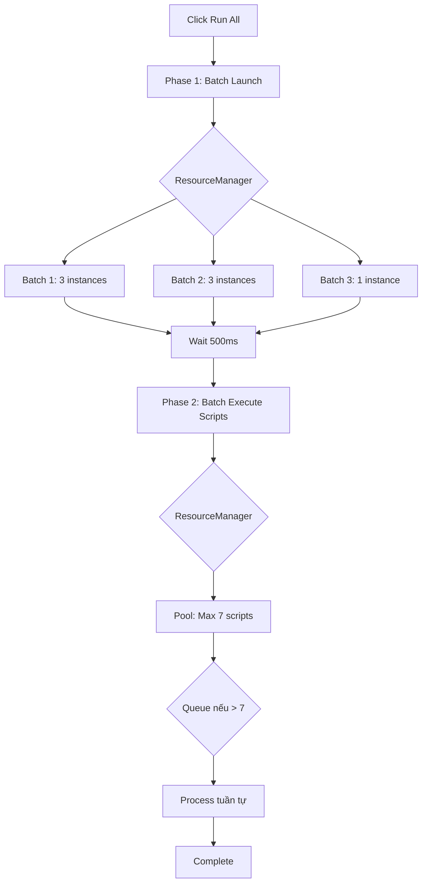

# Hướng Dẫn Quản Lý Tài Nguyên - Resource Management

## Tổng Quan

Hệ thống đã được tối ưu hóa với **ResourceManager** để quản lý tài nguyên khi chạy nhiều instances và scripts đồng thời. Điều này đảm bảo:

✅ Không bị quá tải CPU/RAM
✅ Instances launch ổn định
✅ Scripts chạy song song hiệu quả
✅ Tự động queue khi vượt giới hạn

---

## Cấu Hình Tài Nguyên (.env)

### Các thông số quan trọng:

```env
# Instance Resource Configuration
INSTANCE_CPU=1                      # 1 core/instance (tối ưu cho multi-instance)
INSTANCE_MEMORY=1536                # 1.5GB RAM/instance (giảm từ 2GB)
INSTANCE_RESOLUTION=360,640         # Độ phân giải thấp = hiệu suất cao
INSTANCE_DPI=160                    # DPI chuẩn

# Performance Tuning
INSTANCE_LAUNCH_DELAY=500           # Delay giữa mỗi instance launch (ms)
SCRIPT_START_DELAY=2000             # Đợi trước khi chạy scripts (ms)
MAX_CONCURRENT_LAUNCHES=3           # ⭐ Tối đa 3 instances launch cùng lúc
MAX_CONCURRENT_SCRIPTS=7            # ⭐ Tối đa 7 scripts chạy đồng thời

# Total Limits
MAX_INSTANCES=7                     # Tổng số instances tối đa
```

### Tính Toán Tài Nguyên Cần Thiết:

```
RAM cần thiết = (INSTANCE_MEMORY × MAX_INSTANCES) + 3GB (Windows)
              = (1536MB × 7) + 3GB
              = 10.7GB + 3GB = ~14GB RAM

CPU cần thiết = MAX_INSTANCES × INSTANCE_CPU × 0.7
              = 7 × 1 × 0.7 = ~5 cores
              → Khuyến nghị: CPU 8 cores trở lên
```

---

## Cách Hoạt Động

### 1. Run All Button Logic (InstanceManager)

**Phase 1: Launch Instances với Resource Pooling**

```
Client gọi → /api/profiles/batch-launch
              ↓
         ResourceManager.batchLaunch()
              ↓
     Chia thành batches (mỗi batch 3 instances)
              ↓
     Batch 1: Launch 3 instances → Đợi 500ms
              ↓
     Batch 2: Launch 3 instances → Đợi 500ms
              ↓
     Batch 3: Launch instance cuối
```

**Phase 2: Execute Scripts với Concurrency Control**

```
Client gọi → /api/profiles/batch-execute-scripts
              ↓
         ResourceManager.batchExecuteScripts()
              ↓
     Tối đa 7 scripts chạy đồng thời
              ↓
     Scripts vượt quá → Tự động queue
              ↓
     Xử lý tuần tự khi có slot trống
```

### 2. ResourceManager Pooling

**Launch Pool:**
- Max concurrent: `MAX_CONCURRENT_LAUNCHES` (default: 3)
- Queue tự động khi đầy
- Staggered delay: 500ms giữa mỗi launch

**Script Pool:**
- Max concurrent: `MAX_CONCURRENT_SCRIPTS` (default: 7)
- Queue tự động khi đầy
- Process tuần tự khi có slot

---

## API Endpoints Mới

### 1. Batch Launch Instances

**POST** `/api/profiles/batch-launch`

```json
{
  "profileIds": [1, 2, 3, 4, 5]
}
```

**Response:**
```json
{
  "success": true,
  "total": 5,
  "successCount": 5,
  "failCount": 0,
  "results": [
    { "profileId": 1, "success": true },
    { "profileId": 2, "success": true, "alreadyActive": true },
    ...
  ]
}
```

### 2. Batch Execute Scripts

**POST** `/api/profiles/batch-execute-scripts`

```json
{
  "profileIds": [1, 2, 3, 4, 5]
}
```

**Response:**
```json
{
  "success": true,
  "total": 5,
  "successCount": 3,
  "failCount": 0,
  "noScriptCount": 2,
  "results": [
    { "profileId": 1, "success": true, "hasScript": true, "taskId": "abc123" },
    { "profileId": 2, "success": true, "hasScript": false },
    ...
  ]
}
```

### 3. Get Resource Status

**GET** `/api/resources/status`

**Response:**
```json
{
  "success": true,
  "launches": {
    "active": 2,
    "max": 3,
    "queued": 1,
    "available": 1
  },
  "scripts": {
    "active": 5,
    "max": 7,
    "queued": 3,
    "available": 2
  },
  "limits": {
    "maxConcurrentLaunches": 3,
    "maxConcurrentScripts": 7
  }
}
```

---

## Khuyến Nghị Theo Cấu Hình Máy

### Máy 16GB RAM, 8 Cores (Phổ Biến)

```env
MAX_INSTANCES=7
INSTANCE_CPU=1
INSTANCE_MEMORY=1536
MAX_CONCURRENT_LAUNCHES=3
MAX_CONCURRENT_SCRIPTS=7
```

**Kết quả:**
- 7 instances chạy đồng thời
- 7 scripts chạy song song
- RAM sử dụng: ~14GB (an toàn)

### Máy 32GB RAM, 16 Cores (High Performance)

```env
MAX_INSTANCES=12
INSTANCE_CPU=1
INSTANCE_MEMORY=2048
MAX_CONCURRENT_LAUNCHES=4
MAX_CONCURRENT_SCRIPTS=10
```

**Kết quả:**
- 12 instances chạy đồng thời
- 10 scripts chạy song song
- RAM sử dụng: ~27GB (an toàn)

### Máy 8GB RAM, 4 Cores (Budget)

```env
MAX_INSTANCES=3
INSTANCE_CPU=1
INSTANCE_MEMORY=1024
MAX_CONCURRENT_LAUNCHES=2
MAX_CONCURRENT_SCRIPTS=3
```

**Kết quả:**
- 3 instances chạy đồng thời
- 3 scripts chạy song song
- RAM sử dụng: ~6GB (an toàn)

---

## Monitoring & Debugging

### Kiểm Tra Resource Status

Mở Developer Tools → Console khi click "Run All":

```
[RUN ALL] Active: 2, Inactive: 5
[BATCH LAUNCH] Starting batch launch for 5 profiles
[ResourceManager] Processing batch 1, size: 3
[ResourceManager] Batch launch completed: 5/5 successful
[BATCH SCRIPT] Starting batch script execution for 7 profiles
[ResourceManager] Processing script batch 1, size: 7
```

### Kiểm Tra Tài Nguyên Hệ Thống

**Windows Task Manager:**
- CPU Usage: Không vượt quá 80%
- RAM Usage: Giữ 2-3GB free cho Windows
- Disk: SSD tốt hơn HDD rất nhiều

### Warning Signs

❌ **Instances crash** → Giảm `INSTANCE_MEMORY` hoặc `MAX_INSTANCES`
❌ **Scripts chạy chậm** → Giảm `MAX_CONCURRENT_SCRIPTS`
❌ **System freeze** → Giảm cả `MAX_CONCURRENT_LAUNCHES` và `MAX_INSTANCES`
❌ **Queue quá dài** → Tăng `MAX_CONCURRENT_SCRIPTS` (nếu RAM đủ)

---

## Flow Chart



---

## Best Practices

### 1. Trước Khi Run All

✅ Đóng các apps không cần thiết
✅ Check RAM available (Task Manager)
✅ Đảm bảo LDPlayer instances ở trạng thái tốt
✅ Test với 2-3 instances trước

### 2. Trong Quá Trình Chạy

✅ Monitor CPU/RAM usage
✅ Kiểm tra logs trong Console
✅ Đợi Phase 1 hoàn thành trước khi refresh

### 3. Tối Ưu Hóa

✅ Giảm `INSTANCE_MEMORY` nếu app không cần nhiều RAM
✅ Tăng `MAX_CONCURRENT_SCRIPTS` nếu scripts nhẹ
✅ Giảm `INSTANCE_RESOLUTION` để tiết kiệm tài nguyên
✅ Dùng SSD cho LDPlayer instances

---

## Troubleshooting

### Vấn Đề: Instances launch chậm

**Giải pháp:**
```env
# Tăng delay để ổn định hơn
INSTANCE_LAUNCH_DELAY=1000
# Giảm số instances launch cùng lúc
MAX_CONCURRENT_LAUNCHES=2
```

### Vấn Đề: Scripts bị timeout

**Giải pháp:**
```env
# Tăng script timeout trong code
SCRIPT_TIMEOUT=300000  # 5 phút
# Hoặc giảm số scripts chạy đồng thời
MAX_CONCURRENT_SCRIPTS=5
```

### Vấn Đề: RAM không đủ

**Giải pháp:**
```env
# Giảm RAM mỗi instance
INSTANCE_MEMORY=1024
# Hoặc giảm tổng số instances
MAX_INSTANCES=5
```

---

## Kết Luận

Hệ thống ResourceManager đảm bảo:

1. **Ổn Định:** Launch instances tuần tự, không quá tải
2. **Hiệu Quả:** Scripts chạy song song với concurrency control
3. **Linh Hoạt:** Dễ dàng điều chỉnh qua .env
4. **Mở Rộng:** Tự động queue và xử lý khi vượt giới hạn

**Khuyến nghị:** Bắt đầu với cấu hình mặc định, sau đó điều chỉnh dựa trên cấu hình máy của bạn!
